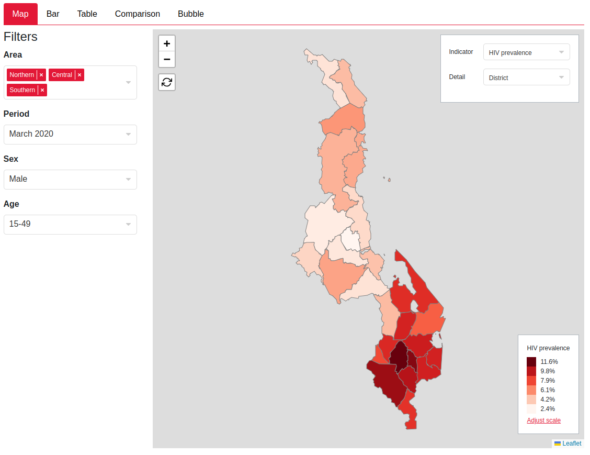
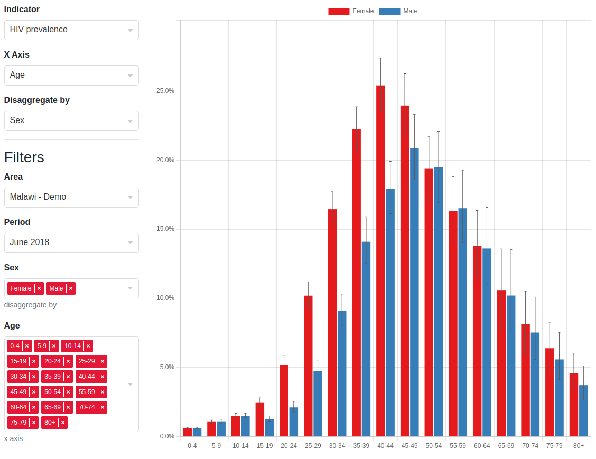
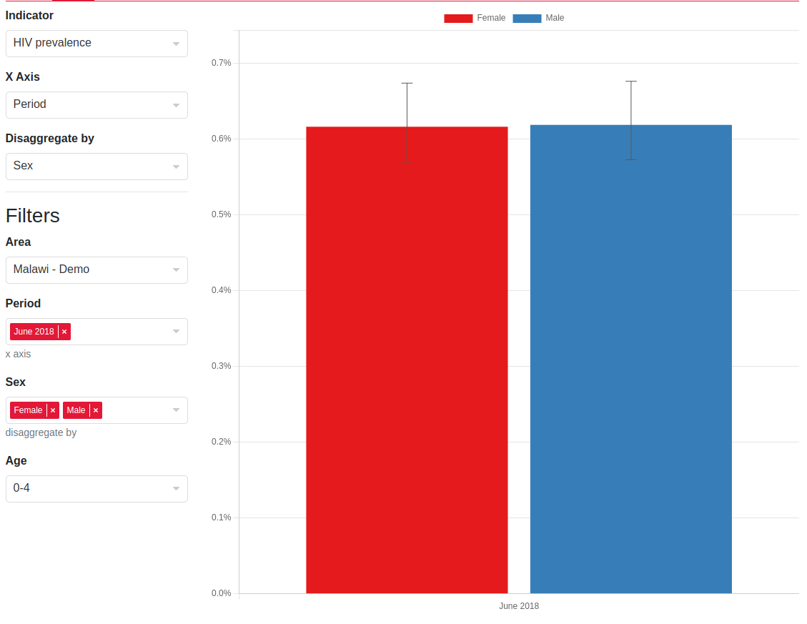
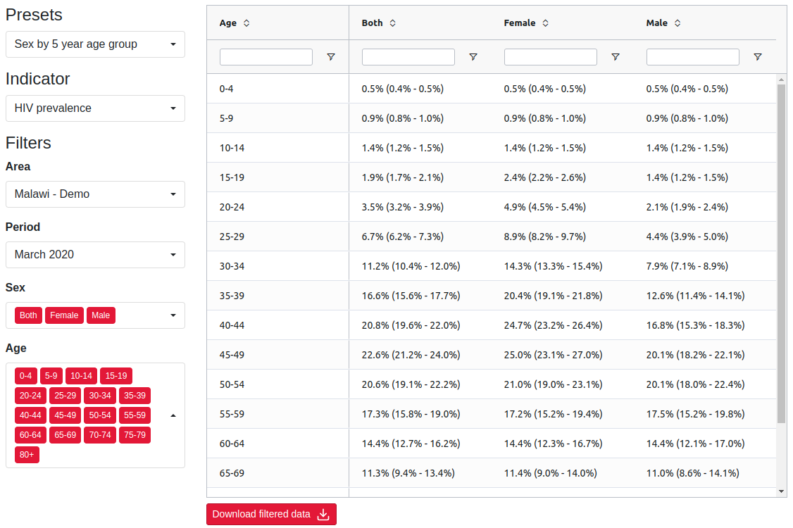
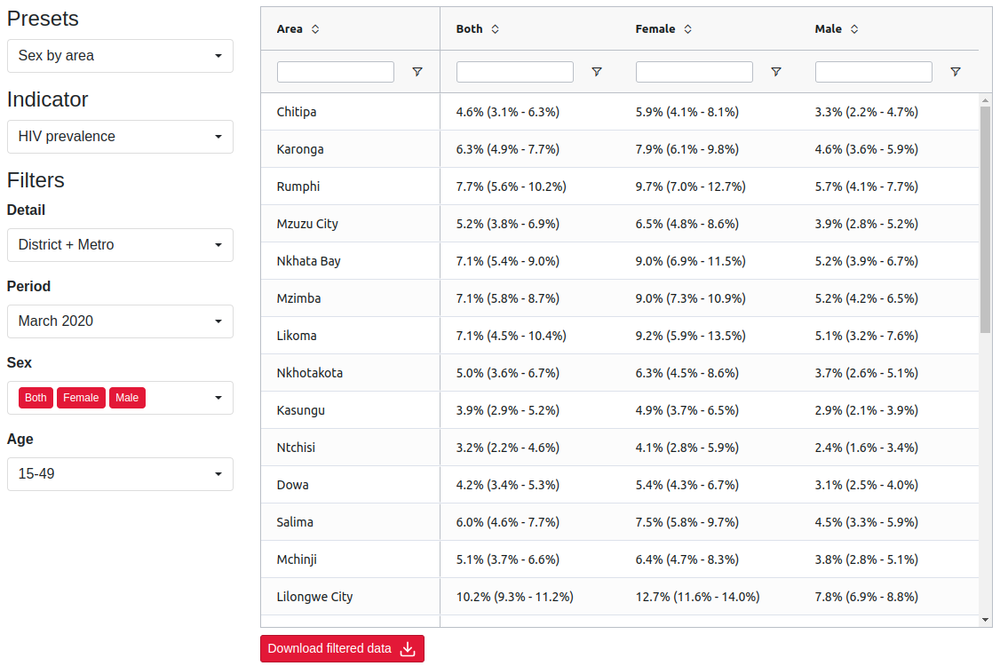

# Metadata driven UI

## Motivation

Historically Hint had different components for their plots each with their own logic on how to handle different filter selections. For example:

### Choropleth


### Barchart



### Table



There are lots of differences between these but the main relevant differences are:
* Some filters are single selects and some are multi-selects
* The barchart's `X Axis` and `Disaggregate by` filters turn whatever is selected into a multi-select dropdown while keeping the rest single selects
* The table's `Presets` dropdown changes the _filters_ that are shown while also changing whether they are multi-selects or single selects and also changing the value of the filters

The aim is to unify these differences into one framework that can support all these dependencies between dropdowns while also allowing for easy additions and modifications.

## Implementation overview

The structure we settled on is the backend (this repository) sending the frontend json reponse that tells it how to construct the UI and also how to dynamically update it based on the value of the dropdowns.

Note: For each tab there is a different response that specifies the metadata:
* [`Review output`](inst/schema/CalibrateMetadataResponse.schema.json)
* [`Calibrate model`](inst/schema/CalibratePlotMetadata.schema.json)
* [`Review inputs`](inst/schema/ReviewInputFilterMetadataResponse.schema.json)

The structure of these are the same bar the keys to the `plotSettingsControl` which identifies the plot. In the bullet points above there are two main types of dropdowns that we want:
1. Dropdowns that influence other dropdowns - we will call these `controls` and call their values `settings`
1. Dropdowns that acts as filters for slicing the data - we will call these `filters` and their values `selections`

A useful visualisation that I'll keep referring to so that we don't get lost in the json nestings is (note that `indicators` is not expanded as this just contains metadata about the indicator values such as their format which isn't relevant to the metadata structure):

```php
├── filterTypes[]
│   ├── id
│   ├── column_id
│   ├── use_shape_regions
│   ├── options[]
│   │   ├── label
│   │   ├── id
│   │   ├── description
├── indicators
├── plotSettingsControl{}
│   ├── defaultEffect
│   │   ├── setFilters
│   │   ├── ... (see effect below)
│   ├── plotSettings[]
│   │   ├── label
│   │   ├── id
│   │   ├── visible
│   │   ├── value
│   │   ├── options[]
│   │   │   │   ├── id
│   │   │   │   ├── label
│   │   │   │   ├── effect
│   │   │   │   │   ├── setFilters
│   │   │   │   │   ├── setMultiple
│   │   │   │   │   ├── setFilterValues
│   │   │   │   │   ├── setHidden
```
This is just a full version of the json schema.

## Filters

```php
├── filterTypes[] # here
│   ├── id # 1
│   ├── column_id # 2
│   ├── use_shape_regions # 3
│   ├── options[] # 4
│   │   ├── label
│   │   ├── id
│   │   ├── description
├── indicators
├── plotSettingsControl{}
│   ├── defaultEffect
│   │   ├── setFilters
│   │   ├── ... (see effect below)
│   ├── plotSettings[]
│   │   ├── label
│   │   ├── id
│   │   ├── visible
│   │   ├── value
│   │   ├── options[]
│   │   │   │   ├── id
│   │   │   │   ├── label
│   │   │   │   ├── effect
│   │   │   │   │   ├── setFilters
│   │   │   │   │   ├── setMultiple
│   │   │   │   │   ├── setFilterValues
│   │   │   │   │   ├── setHidden
```
The `filterTypes` key is the simplest. It is an array of all the filters that can be displayed in the UI with their options. Explanations for each number in the visualisation:
1. The `id` is just an id we can assign to the filter to refer to it later
1. The `column_id` this is the column name of the data which we have to filter
1. `use_shape_regions` is a boolean that should largely be ignored, it is a one off trick to reduce the amount of payload we send to the frontend by telling it to derive the options of a filter select with this boolean from the shape file that the user has uploaded
1. The `options` are the options visible to the user in the dropdown, with an `id` for the store, the `label` for what to display in the dropdown menu and an optional `description` prop for contextual information (this doesn't get displayed to the user at all)

## Plot Settings Control

```php
├── filterTypes[]
│   ├── id
│   ├── column_id
│   ├── use_shape_regions
│   ├── options[]
│   │   ├── label
│   │   ├── id
│   │   ├── description
├── indicators
├── plotSettingsControl{} # here
│   ├── defaultEffect # 1
│   │   ├── setFilters
│   │   ├── ... (see effect below)
│   ├── plotSettings[] # 2
│   │   ├── label # 3
│   │   ├── id # 4
│   │   ├── visible # 5
│   │   ├── value # 6
│   │   ├── options[]
│   │   │   │   ├── id # a
│   │   │   │   ├── label
│   │   │   │   ├── effect
│   │   │   │   │   ├── setFilters
│   │   │   │   │   ├── setMultiple
│   │   │   │   │   ├── setFilterValues
│   │   │   │   │   ├── setHidden
```

The plot settings controls is an object with keys of the relevant plot name (e.g. `choropleth`) and value with the structure shown in the visualisation. Explanation of keys:

1. `defaultEffect` is the base effect applied to all `settings` (remember these are the values of the `control` dropdown) - more on this later
1. `plotSettings` is an array of all the `controls` a tab will have
1. `label` is the title of the dropdown the user will see in the UI
1. `id` is the id of the plot settings (this id is how the store keeps track of which `setting` of the `control` is selected)
1. `visible` boolean - there are times we want the `control` to be invisible. The calibrate plot reuses the barchart component however they expect an `X Axis` and `Disaggregate by` control - these controls are fixed in the calibrate plot so we set them to a constant value and hide them from the user allowing us to reuse the barchart component without any special code
1. `value` is an optional key to set the default value of the `control` as something other than the default (default in frontend for single select is the first value and for a multi-select is all the values). This is the `id` of the option (`a` in the visualisation)

## Settings

```php
├── filterTypes[]
│   ├── id
│   ├── column_id
│   ├── use_shape_regions
│   ├── options[]
│   │   ├── label
│   │   ├── id
│   │   ├── description
├── indicators
├── plotSettingsControl{}
│   ├── defaultEffect
│   │   ├── setFilters
│   │   ├── ... (see effect below)
│   ├── plotSettings[]
│   │   ├── label
│   │   ├── id
│   │   ├── visible
│   │   ├── value
│   │   ├── options[] # here
│   │   │   │   ├── id # 1
│   │   │   │   ├── label # 2
│   │   │   │   ├── effect # 3
│   │   │   │   │   ├── setFilters
│   │   │   │   │   ├── setMultiple
│   │   │   │   │   ├── setFilterValues
│   │   │   │   │   ├── setHidden
```

The `settings` completely determine the `filters` and their `selections`. The next section will go through each effect and how the frontend resolves it but for now, explanation of keys:

1. `id` for the store to record what `setting` is chosen
1. `label` displayed to the user in the dropdown menu
1. The `effect` key is probably the most important idea here. Every `setting` has an effect associated with it and aggregating all the effects along all the settings the user has chosen completely determines the `filters` and their initial `selections` that are shown to the user. So everything can be derived from just the `settings` that are chosen

## Effects

```php
├── filterTypes[]
│   ├── id # a
│   ├── column_id
│   ├── use_shape_regions
│   ├── options[]
│   │   ├── label
│   │   ├── id # b
│   │   ├── description
├── indicators
├── plotSettingsControl{}
│   ├── defaultEffect # (here as well)
│   │   ├── setFilters
│   │   ├── ... (see effect below)
│   ├── plotSettings[]
│   │   ├── label
│   │   ├── id
│   │   ├── visible
│   │   ├── value
│   │   ├── options[]
│   │   │   │   ├── id
│   │   │   │   ├── label
│   │   │   │   ├── effect # here
│   │   │   │   │   ├── setFilters
│   │   │   │   │   ├── setMultiple
│   │   │   │   │   ├── setFilterValues
│   │   │   │   │   ├── setHidden
```

For this section we will need a more detailed view of the effects structure

```php
├── setFilters[] # 1
│   ├── filterId # 1.1
│   ├── label # 1.2
│   ├── stateFilterId # 1.3
├── setMultiple[] # 2
├── setFilterValues{} # 3
├── setHidden[] # 4
```

Explanation of each effect and how the frontend aggregates this:
1. `setFilters` is how the effect specifies what `filters` the user sees from the `filterTypes` The frontend aggregates this by replacing it. So if two `settings` set filters, the last `setFilters` in the for loop would be used when going through all the `settings`. Keys:
    1. `filterId` is the `id` key in a `filterTypes`element (`a` in the visualisation)
    1. `label` is the title of the `filter` displayed to the user in the UI
    1. `stateFilterId` is the id the state uses to identify this filter. This is distinct to the `filterId` because in the bubble plot we have two indicators filters that are the same filter type (so have the same `options` and the same `column_id`) however they are distinct because one controls the color of the bubbles and one controls the size of the bubbles so while both their `filterId`s are `indicator`, the `stateFilterId`s for both are different, `colorIndicator` and `sizeIndicator`. For most cases this can be set as the same thing as the `filterId`. All other effects will now identify filters by `stateFilterId` as these uniquely correspond to what the user sees
1. `setMultiple` is an effect that sets a `filter` to a multi-select dropdown (they are all single select by default). It is an array of `stateFilterId`s (`1.3` in the visualisation) This is aggregated via concatenation in the frontend so if two settings have `setMultiple` properties `["state_id_1", "state_id_2"]` and `["state_id_3"]` respectively then all three filters with those state ids will be set to multi-selects
1. `setFilterValues` is an effect that sets the selection of the filters in `setFilters`. It is an object with keys equal to `stateFilterId` and value an array of ids of the `selections` (`b` in the visualisation). Note this is still an array of length one if you want to specify a value for a single select filter. This is aggregated by the [spread operator](https://developer.mozilla.org/en-US/docs/Web/JavaScript/Reference/Operators/Spread_syntax#spread_in_object_literals) in the frontend
1. `setHidden` is an effect that hides `filters` and is usually used when we have a fixed filter that we don't want the user to change but is still required to slice the data. This is aggregated via concatenation in the frontend

## Typescript definition and derived frontend store

I have used the directory-structure-esque visualisation for most of this because it is simple and obscures a lot of the types and other information as that would be too much to throw. But now that you know how the metadata works, here is the full typescript definition of it with contextual types (instead of just `string`, it shows which type of string it refers to, e.g. whether it is `stateFilterId` or `filterId`):

```typescript
type FilterId = string
type StateFilterId = string
type ColumnId = string
type SelectionId = string
type PlotControlId = string
type PlotSettingId = string
type PlotName = string

type FilterOption = {
    id: SelectionId,
    label: string,
    description: string
}

type FilterType = {
    id: FilterId,
    column_id: ColumnId,
    options: FilterOption[]
}

type FilterRef = {
    filterId: FilterId,
    label: string,
    stateFilterId: StateFilterId
}

type PlotSettingEffect = {
    setFilters?: FilterRef[],
    setMultiple?: StateFilterId[],
    setFilterValues?: Record<StateFilterId, SelectionId[]>,
    setHidden?: StateFilterId[]
}

type PlotSettingOption = {
    id: PlotSettingId,
    label: string,
    effect: PlotSettingEffect
}

type PlotSetting = {
    id: PlotControlId,
    label: string,
    visible?: boolean,
    value?: PlotSettingId,
    options: PlotSettingOption[]
}

type PlotSettingsControl = {
    defaultEffect: PlotSettingEffect,
    plotSettings: PlotSetting[]
}

type MetadataStructure = {
    filterTypes: FilterType[],
    indicators: any, // irrelevant 
    plotSettingsControl: {
        // example of plotName can be choropleth or table, etc
        [plotName: PlotName]: PlotSettingsControl
    }
}
```

### Selections state

Remember the frontend store is also fully derived from this metadata. Nothing is hardcoded in the store expect for the `plotNames` so the derived store takes the type:

```typescript
type FilterSelection = {
    multiple: boolean
    selection: FilterOption[],
    hidden: boolean
} & FilterRef

type ControlSelection = {
    id: PlotControlId,
    label: string,
    selection: FilterOption[]
}

type FrontendSelectionState = {
    // these plotNames keys in the type are the generated keys from
    // the json schema in Hintr
    [plotName: PlotName]: {
        controls: ControlSelection[]
        filters: FilterSelection[]
    }
} & { error: Error }
```

Note that the state stores some extra information other than the selections of each of the dropdowns, this is to reduce the need to parse the metadata all the time. However, every time an update to the `controls` occurs. the frontend has to parse the metadata, aggregate all the effects and dynamically render all the filters again. In practice this is very fast.

### Data state

The data state is quite simple. It takes the form:

```typescript
type FrontendDataState = {
    // just an array of filtered data
    [plotName: PlotName]: any[]
}
```
