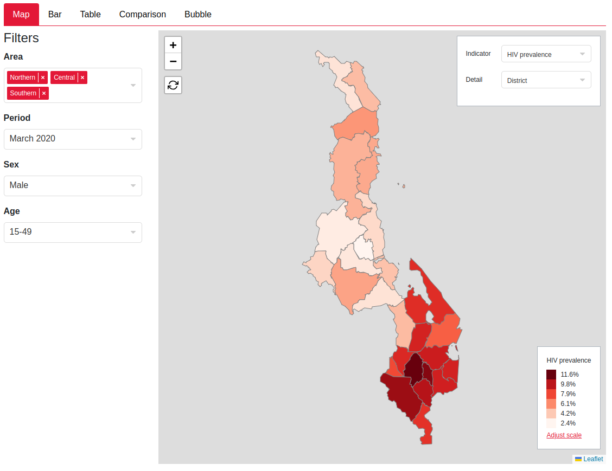
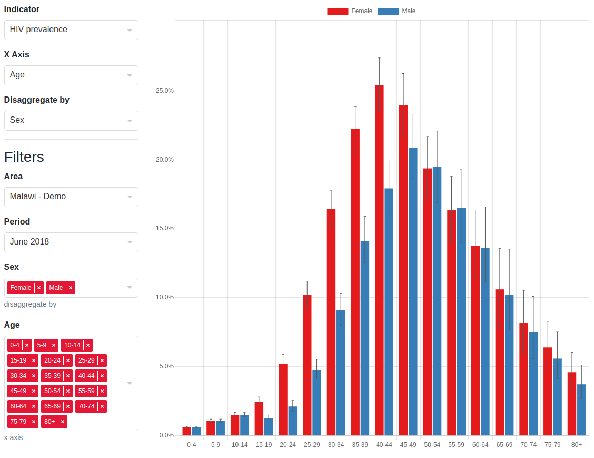
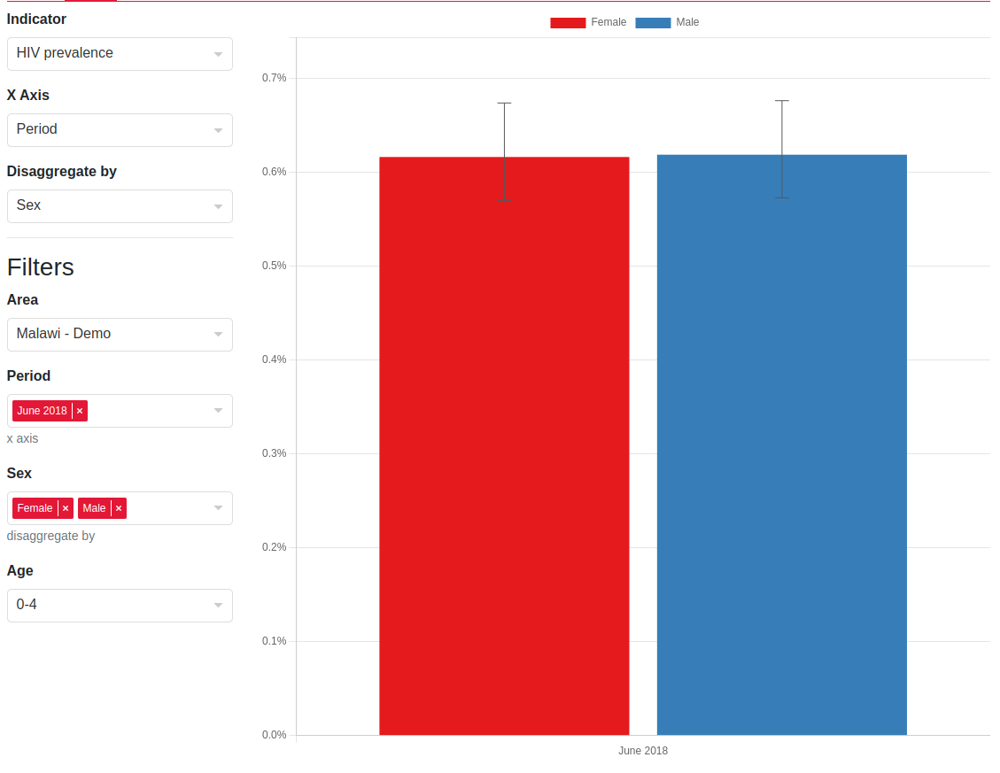
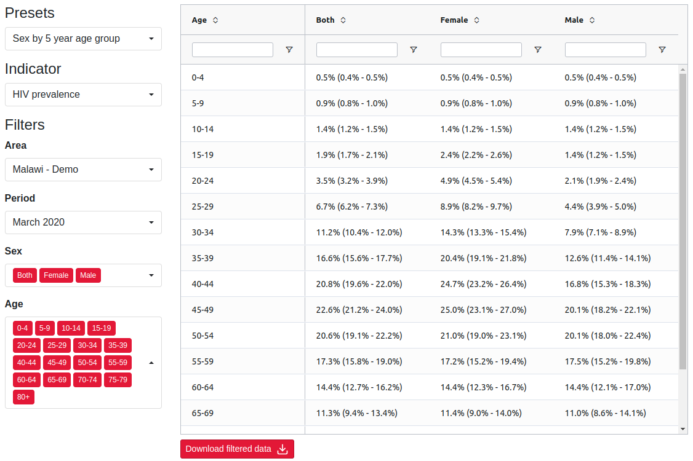
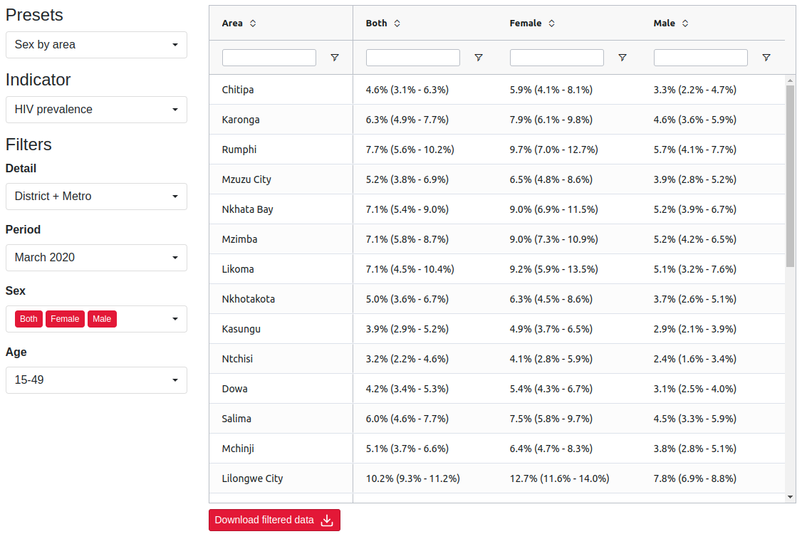

```{r, include = FALSE}
knitr::opts_chunk$set(
  collapse = TRUE,
  comment = "#>"
)
```

## Motivation

We wanted to create a unified way to add filters and controls for all our plots in the front end. Previously there were different approaches to this for each plot but we wanted to create a unified way to reduce code duplication, make the interface consistent and mean enhancements to one plot can easily be ported over to all others. The drop downs in the side bar are split into two sections, plot controls and filters.

1. `controls` - dropdowns that influence other dropdowns
1. `filters` - dropdowns that act as filters for slicing the data

The `controls` can run `effects` to modify the filters such as:

* Set specific filters as multi-selects. For example, in the barchart users can select an `X Axis` and `Disaggregate by` controls which set whatever is selected into a multi-select dropdown, while keeping the rest as single selects. See barchart screenshot
* Set selected value for a filter e.g. if users select an indicator we might want to select specific sex and age groups which have data for this indicator e.g. ANC indicators should be female and 15-49.
* Set filters e.g. ART data has a column for period, ANC data has a column for year, we want to show the period for filter for ART only and the year filter for ANC only
* Filters can be hidden if we want to simplify the UI to remove clutter for users whilst ensuring we still filter the underlying data
* Set custom effects that the plot impl can pick up on and use to control the plot UI e.g. in the table we have a custom effect which defines for each control what is displayed as a header and as a row in the table view.

Below are some examples of the plot control and filter UIs that the metadata allow us to build

### Choropleth

* Area as a multiselect

{width="100%"}

### Barchart

* Indicator control sets filter values
* `X Axis` & `Disaggregate by` set the selected filters as multiselects

{width="100%"}
{width="100%"}

### Table

* Presets set specific filters as multiselects and what filter to use as the header group and row
* Indicator sets specific filter values to relevant ones for that indicator

{width="100%"}
{width="100%"}

## Implementation overview

The backend (this repository) provides metadata JSON endpoints that tell the frontend how to construct the UI and also how to dynamically update it based on the value of the dropdowns.

For details on where metadata is currently served from see [Endpoints](#endpoints) section.

Reminder that there are two types of dropdowns that can be created via metadata:

1. Dropdowns that influence other dropdowns - we will call these `controls` and call their values `settings`
1. Dropdowns that acts as filters for slicing the data - we will call these `filters` and their values `selections`

Here is a useful visualisation of the schema that I'll keep referring to so that we don't get lost in the JSON nesting (note that `indicators` is not expanded as this just contains metadata about the indicator values such as their format which isn't relevant to the metadata structure):

```php
├── filterTypes[]
│   ├── id
│   ├── column_id
│   ├── use_shape_regions
│   ├── options[]
│   │   ├── label
│   │   ├── id
│   │   ├── description
├── indicators
├── plotSettingsControl{}
│   ├── defaultEffect
│   │   ├── setFilters
│   │   ├── ... (see effect below)
│   ├── plotSettings[]
│   │   ├── label
│   │   ├── id
│   │   ├── hidden
│   │   ├── value
│   │   ├── options[]
│   │   │   │   ├── id
│   │   │   │   ├── label
│   │   │   │   ├── effect
│   │   │   │   │   ├── setFilters
│   │   │   │   │   ├── setMultiple
│   │   │   │   │   ├── setFilterValues
│   │   │   │   │   ├── setHidden
│   │   │   │   │   ├── customPlotEffect
```
This is just a full version of the json schema.

## Filters

```php
├── filterTypes[] # here
│   ├── id # 1
│   ├── column_id # 2
│   ├── use_shape_regions # 3
│   ├── options[] # 4
│   │   ├── label
│   │   ├── id
│   │   ├── description
├── indicators
├── plotSettingsControl{}
│   ├── defaultEffect
│   │   ├── setFilters
│   │   ├── ... (see effect below)
│   ├── plotSettings[]
│   │   ├── label
│   │   ├── id
│   │   ├── hidden
│   │   ├── value
│   │   ├── options[]
│   │   │   │   ├── id
│   │   │   │   ├── label
│   │   │   │   ├── effect
│   │   │   │   │   ├── setFilters
│   │   │   │   │   ├── setMultiple
│   │   │   │   │   ├── setFilterValues
│   │   │   │   │   ├── setHidden
│   │   │   │   │   ├── customPlotEffect
```
The `filterTypes` key is the simplest. It is an array of all the filters that can be displayed in the UI with their options. Explanations for each number in the visualisation:

1. The `id` is just an id we can assign to the filter to refer to it later
1. The `column_id` this is the column id of the data which we have to filter
1. `use_shape_regions` is a boolean that should largely be ignored, it is a one off trick for geographical area filters only to reduce the amount of payload we send to the frontend by telling it to derive the options of a filter select with this boolean from the shape file that the user has uploaded
1. The `options` are the options visible to the user in the dropdown. Each option has an `id` by which filter selections can refer to the option, a `label` to display in the dropdown menu and an optional `description` prop for contextual information (this doesn't get displayed to the user at all)

## Plot Settings Control

```php
├── filterTypes[]
│   ├── id
│   ├── column_id
│   ├── use_shape_regions
│   ├── options[]
│   │   ├── label
│   │   ├── id
│   │   ├── description
├── indicators
├── plotSettingsControl{} # here
│   ├── defaultEffect # 1
│   │   ├── setFilters
│   │   ├── ... (see effect below)
│   ├── plotSettings[] # 2
│   │   ├── label # 3
│   │   ├── id # 4
│   │   ├── hidden # 5
│   │   ├── value # 6
│   │   ├── options[]
│   │   │   │   ├── id # a
│   │   │   │   ├── label
│   │   │   │   ├── effect
│   │   │   │   │   ├── setFilters
│   │   │   │   │   ├── setMultiple
│   │   │   │   │   ├── setFilterValues
│   │   │   │   │   ├── setHidden
│   │   │   │   │   ├── customPlotEffect
```

The plot settings controls is an object with keys of the relevant plot name (e.g. `choropleth`) and value with the structure shown in the visualisation. Explanation of keys:

1. `defaultEffect` is the base effect applied to all `settings` (remember these are the values of the `control` dropdown) - more on this later
1. `plotSettings` is an array of all the `controls` a tab will have
1. `label` is the title of the dropdown the user will see in the UI
1. `id` is the id of the plot settings (this id is how the store keeps track of which `setting` of the `control` is selected)
1. `hidden` boolean - there are times we want the `control` to be invisible. The calibrate plot reuses the barchart component, however they expect an `X Axis` and `Disaggregate by` control - these controls are fixed in the calibrate plot so we set them to a constant value and hide them from the user allowing us to reuse the barchart component without any special code
1. `value` is an optional key to set the default value of the `control` as something other than the default (default in frontend for single select is the first value and for a multi-select is all the values). This is the `id` of the option (`a` in the visualisation)

## Settings

```php
├── filterTypes[]
│   ├── id
│   ├── column_id
│   ├── use_shape_regions
│   ├── options[]
│   │   ├── label
│   │   ├── id
│   │   ├── description
├── indicators
├── plotSettingsControl{}
│   ├── defaultEffect
│   │   ├── setFilters
│   │   ├── ... (see effect below)
│   ├── plotSettings[]
│   │   ├── label
│   │   ├── id
│   │   ├── hidden
│   │   ├── value
│   │   ├── options[] # here
│   │   │   │   ├── id # 1
│   │   │   │   ├── label # 2
│   │   │   │   ├── effect # 3
│   │   │   │   │   ├── setFilters
│   │   │   │   │   ├── setMultiple
│   │   │   │   │   ├── setFilterValues
│   │   │   │   │   ├── setHidden
│   │   │   │   │   ├── customPlotEffect
```

The `settings` completely determine the `filters` and their `selections`. The next section will go through each effect and how the frontend resolves it but for now, explanation of keys:

1. `id` for the store to record what `setting` is chosen
1. `label` displayed to the user in the dropdown menu
1. The `effect` key is probably the most important idea here. Every `setting` has an effect associated with it and aggregating all the effects along all the settings the user has chosen completely determines the `filters` and their initial `selections` that are shown to the user. So everything can be derived from just the `settings` that are chosen

## Effects

Effects are the actions that can be undertaken when a plot control is selected. They can be used to modify the filters and set custom effects which can be used by the plot. 

```php
├── filterTypes[]
│   ├── id # a
│   ├── column_id
│   ├── use_shape_regions
│   ├── options[]
│   │   ├── label
│   │   ├── id # b
│   │   ├── description
├── indicators
├── plotSettingsControl{}
│   ├── defaultEffect # (here as well)
│   │   ├── setFilters
│   │   ├── ... (see effect below)
│   ├── plotSettings[]
│   │   ├── label
│   │   ├── id
│   │   ├── hidden
│   │   ├── value
│   │   ├── options[]
│   │   │   │   ├── id
│   │   │   │   ├── label
│   │   │   │   ├── effect # here
│   │   │   │   │   ├── setFilters
│   │   │   │   │   ├── setMultiple
│   │   │   │   │   ├── setFilterValues
│   │   │   │   │   ├── setHidden
│   │   │   │   │   ├── customPlotEffect
```

For this section we will need a more detailed view of the effects structure:

```php
├── setFilters[] # 1
│   ├── filterId # 1.1
│   ├── label # 1.2
│   ├── stateFilterId # 1.3
├── setMultiple[] # 2
├── setFilterValues{} # 3
├── setHidden[] # 4
├── customPlotEffect{} # 5
```

Explanation of each effect and how the frontend aggregates this:

1. `setFilters` is how the effect specifies what `filters` the user sees from the `filterTypes`. Only one `setFilters` effect is used, they are not combined. So if two `settings` set filters, the last `setFilters` in the for loop would be used when going through all the `settings`. Keys:
    1. `filterId` is the `id` key in a `filterTypes`element (`a` in the schema above)
    1. `label` is the title of the `filter` displayed to the user in the UI
    1. `stateFilterId` is the id the state uses to identify this filter. This is distinct to the `filterId` because in the bubble plot we have two indicators filters that are the same filter type (so have the same `options` and the same `column_id`) however they are distinct because one controls the color of the bubbles and one controls the size of the bubbles so while both their `filterId`s are `indicator`, the `stateFilterId`s for both are different, `colorIndicator` and `sizeIndicator`. For most cases this can be set as the same thing as the `filterId`. All other effects will now identify filters by `stateFilterId` as these uniquely correspond to what the user sees
1. `setMultiple` is an effect that converts a `filter` to a multi-select dropdown (they are all single select by default). It is an array of `stateFilterId`s (`1.3` in the schema) This is aggregated via concatenation in the frontend so if two settings have `setMultiple` properties `["state_id_1", "state_id_2"]` and `["state_id_3"]` respectively then all three filters with those state ids will be set to multi-selects
1. `setFilterValues` is an effect that sets the selection of the filters in `setFilters`. It is an object with keys equal to `stateFilterId` and value an array of ids of the `selections` (`b` in the schema). Note this is still an array of length one if you want to specify a value for a single select filter. This is aggregated by the [spread operator](https://developer.mozilla.org/en-US/docs/Web/JavaScript/Reference/Operators/Spread_syntax#spread_in_object_literals) in the frontend
1. `setHidden` is an effect that hides `filters` and is usually used when we have a fixed filter that we don't want the user to change but is still required to slice the data. This is aggregated via concatenation in the frontend
1. `customPlotEffect` is an effect that plots can use to build reactive UI from for a specific plot type. At the moment we are only using this in the table, so set the row and header groups. But it could be expanded to general metadata which we want a plot control to update, but does not have an effect on the filters themselves.

### stateFilterId vs filterId

To hammer it home for Rob because he can't remember this no matter how many times he reads it. `FilterRef`s have a `filterId` and ` stateFilterId`

* `filterId` - used to identify the `id` in the full set of `filters` i.e. to get the label and options for this filter
* `stateFilterId` - reference to this filter within the rest of the metadata and the effects i.e. to identify which drop down to update when a plot control changes

This is because on the bubble plot, there are two drop downs which have `indicator` as their options, but run different effects.

## Typescript definition and derived frontend store

I have used the directory-structure-esque visualisation for most of this because it is simple and obscures a lot of the types and other information as that would be too much to throw. But now that you know how the metadata works, here is the full typescript definition of it with contextual types (instead of just `string`, it shows which type of string it refers to, e.g. whether it is `stateFilterId` or `filterId`):

```typescript
type FilterId = string
type StateFilterId = string
type ColumnId = string
type SelectionId = string
type PlotControlId = string
type PlotSettingId = string
type PlotName = string

type FilterOption = {
    id: SelectionId,
    label: string,
    description: string
}

type FilterType = {
    id: FilterId,
    column_id: ColumnId,
    options: FilterOption[]
}

type FilterRef = {
    filterId: FilterId,
    label: string,
    stateFilterId: StateFilterId
}

type PlotSettingEffect = {
    setFilters?: FilterRef[],
    setMultiple?: StateFilterId[],
    setFilterValues?: Record<StateFilterId, SelectionId[]>,
    setHidden?: StateFilterId[],
    customPlotEffect?: any
}

type PlotSettingOption = {
    id: PlotSettingId,
    label: string,
    effect: PlotSettingEffect
}

type PlotSetting = {
    id: PlotControlId,
    label: string,
    hidden?: boolean,
    value?: PlotSettingId,
    options: PlotSettingOption[]
}

type PlotSettingsControl = {
    defaultEffect: PlotSettingEffect,
    plotSettings: PlotSetting[]
}

type MetadataStructure = {
    filterTypes: FilterType[],
    indicators: any, // irrelevant 
    plotSettingsControl: {
        // example of plotName can be choropleth or table, etc
        [plotName: PlotName]: PlotSettingsControl
    }
}
```

### Selections state

Remember the frontend store is also fully derived from this metadata. Nothing is hardcoded in the store expect for the `plotNames` so the derived store takes the type:

```typescript
type FilterSelection = {
    multiple: boolean
    selection: FilterOption[],
    hidden: boolean
} & FilterRef

type ControlSelection = {
    id: PlotControlId,
    label: string,
    selection: FilterOption[]
}

type FrontendSelectionState = {
    // these plotNames keys in the type are the generated keys from
    // the json schema in Hintr
    [plotName: PlotName]: {
        controls: ControlSelection[]
        filters: FilterSelection[]
    }
} & { error: Error }
```

Note that the state stores some extra information other than the selections of each of the dropdowns, this is to reduce the need to parse the metadata all the time. However, every time an update to the `controls` occurs. the frontend has to parse the metadata, aggregate all the effects and dynamically render all the filters again. In practice this is very fast.

### Data state

The data state is quite simple. It takes the form:

```typescript
type FrontendDataState = {
    // just an array of filtered data
    [plotName: PlotName]: any[]
}
```

## Endpoints {#endpoints}

For each data source in the frontend UI there is a different endpoint and associated JSON schema that specifies the metadata. Note this will probably go stale but should give a starting point

| Step | Plot | Data source | Metadata source | Schema |
|------|------|-------------|-----------------|--------|
| Input review | Time series | `/chart-data/input-time-series/<anc/art>` | `/review-input/metadata` | [Review inputs](../inst/schema/ReviewInputFilterMetadataResponse.schema.json) |
| Input review | Choropleth | `/validate/survey-and-programme` |`/review-input/metadata` | [Review inputs](../inst/schema/ReviewInputFilterMetadataResponse.schema.json) |
| Input review | Comparison table | `/chart-data/input-comparison` | `/chart-data/input-comparison` | [Input comparison](../inst/schema/InputComparisonResponse.schema.json) |
| Input review | Comparison barchart |`/chart-data/input-comparison` | `/chart-data/input-comparison` | [Input comparison](../inst/schema/InputComparisonResponse.schema.json) |
| Input review | Population | `/validate/baseline-individual` only for population data |`/chart-data/input-population` | [Input population](../inst/schema/InputPopulationMetadataResponse.schema.json) |
| Calibrate | Calibration barchart | `/calibrate/plot/<id>` | `/calibrate/plot/<id>` | [Calibrate plot](../inst/schema/CalibratePlotResponse.schema)|
| Output review | Choropleth | `/calibrate/result/path/<id>` (*)| `/calibrate/result/metadata/<id>` | [Review output](../inst/schema/CalibrateMetadataResponse.schema.json)|
| Output review | Barchart | `/calibrate/result/path/<id>` (*)| `/calibrate/result/metadata/<id>` | [Review output](../inst/schema/CalibrateMetadataResponse.schema.json)|
| Output review | Choropleth | `/calibrate/result/path/<id>` (*)| `/calibrate/result/metadata/<id>` | [Review output](../inst/schema/CalibrateMetadataResponse.schema.json)|
| Output review | Table | `/calibrate/result/path/<id>` (*)| `/calibrate/result/metadata/<id>` | [Review output](../inst/schema/CalibrateMetadataResponse.schema.json)|
| Output review | Comparison | `/comparison/plot/<id>` | `/comparison/plot/<id>` | [Output comparison](../inst/schema/CalibrateMetadataResponse.schema.json)|
| Output review | Bubble | `/calibrate/result/path/<id>` (*)| `/calibrate/result/metadata/<id>` | [Review output](../inst/schema/ComparisonPlotResponse.schema)|
| Output review | Cascade | `/calibrate/result/path/<id>` (*)| `/calibrate/result/metadata/<id>` | [Review output](../inst/schema/ComparisonPlotResponse.schema)|

(*) Kotlin backend gets the path to the duckdb output file using hintr endpoint at `/calibrate/result/path/<id>`. It then slices this using SQL based on the filters the user set in the front end. So we only return the slice of data the user is looking at.

Note that data and metadata can be in the same endpoint or different ones. Favour returning them from the same endpoint unless splitting them up will significantly speed up the UI e.g. returning metadata for output plots all together saves reading the output and building the filters from this multiple times. In general, I think having the data & metadata returned together is simpler.

## Front end implementation

This section gives an overview of how the front end handles the metadata and where any custom logic for a specific plot should be injected. The aim of the front end impl is that the wiring up of state will be as straight forward as possible, and we get as much code use as possible.

### Overview

#### Data fetching

**For output plots** data is fetched on demand when users set filters, therefore there is no big blob of data in state
**For all other plots** data is pre-fetched via a store action. This might be when an input file is uploaded (e.g. population, survey, ART, ANC), or when a plot is opened e.g. input comparison, input time series. Data is fetched via an action and saved in the store state somewhere, this varies from data source to data source but will be in `baseline`, `surveyAndProgramme`, `reviewInput`

#### Metadata fetching

Metadata is fetched via a store action which calls to endpoints in the table above. It can be fetched as part of the same endpoint as the data, or separately. When metadata is fetched separately we typically do a couple of modifications before saving it into the store. Firstly, if the data has `use_shape_regions` or `use_shape_area_level` set we fill in these filter options from those already in state. We also commit the initial selections, this runs any default effects and saves them resulting controls and filters into `plotSelections` state, it also runs `getPlotData` which manges running the plot-specific filtering logic and saves this into the `plotData` state.

#### On mount

The plot should have a prop which is of type `PlotName`. It should then read the metadata via the `getMetadataFromPlotName` helper and use the data from `plotData` state. For each specific plot, it should then modify the `plotData` into a structure which can be used by plot component. Potentially using metadata if it needs, including any `customPlotEffect`s for the selection.

#### On plot control/filter update

This dispatches an action `plotSelections/updateSelections` which runs any effects to get the new state, it then runs `getPlotData` updating the `plotData` in state with the filtered data.

### Adding new plot

If you are using an existing data source or metadata source, you will need to

1. Add metadata into existing endpoint or new endpoint
1. If a new endpoint, add an action which fetched the metadata, runs `filtersAfterUseShapeRegions` and `commitPlotDefaultSelections`.
1. Add the new plot type into `PlotName`
1. Add handling for new plot type into `getMetadataFromPlotName`, it should just map to the location of the metadata
1. Add handling for new plot type into `getPlotData`, if this is using a new data source, write a function to do the filtering for this data source, and run any specific logic for this data source type.
1. Write the component pulling data from `plotData` state and metadata via `getMetadataFromPlotName`.

### Where do I write custom logic?

**Modify the metadata before it is ever used**, write it in the action after the data is fetched and before it saved to state. For exampe, setting options for a filter to those from the shape file.

**Customise the filter logic**, write it in one of the function `getPlotData` calls to. For example can use this to switch between different data sources in one plot (time series), derive some data from selections (population data gets aggregated to selected level)

**Modify selections when a plot control changes**, hook into the filtering logic, you can do this in `handlePlotControlOverrides`. We have used this to set x-axis for the comparison barchart. Plot selections cannot by default update other plot selections, but we wanted this for the comparison barchart. We wanted the UI to show a "plot type" control but not let users modify the x-axis because they could easily break the display. Instead we have a hidden x-axis and then hook into the filtering logic to set the x-axis control if the "plot control" is changed. This one I think we should be careful with, if we spot common overrides we should think about refactoring this into an effect. 

**Modify the plot itself based on a plot control**, use a `customPlotEffect` to set metadata for this specific plot selection e.g. for the table we specify in `customPlotEffect` what category in the data should be a column group or shown in the rows.


